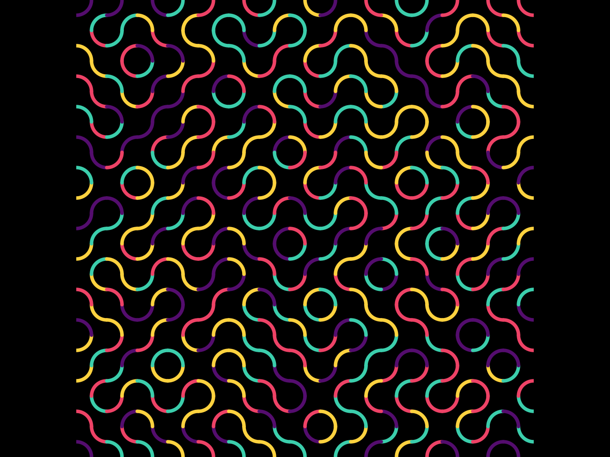

# Truchet Tiles with plotnine

This project explores generative Truchet tile patterns built in Python with the `plotnine` plotting library. The notebook walks through assembling a repeating grid of curved tiles, styling the segments with a bold four-color palette, and exporting the final design-ready artwork.

  



## Repository Contents
- `tiles.ipynb` – Jupyter notebook that constructs and styles the Truchet tile grid with plotnine
- `README.md` – Project overview and usage notes

## Getting Started
1. Install Python 3.10+ and create a virtual environment (optional but recommended).
2. Install the notebook dependencies:
   ```bash
   pip install plotnine pandas numpy
   ```
3. Launch Jupyter Lab or Notebook:
   ```bash
   jupyter lab tiles.ipynb
   ```
4. Run the cells in order to generate the tile geometry, assign the color palette, and render the final plot.

## Customization Tips
- Adjust the palette by editing the color list near the styling section of the notebook.
- Experiment with tile orientations, grid size, and stroke widths to explore new compositions.


